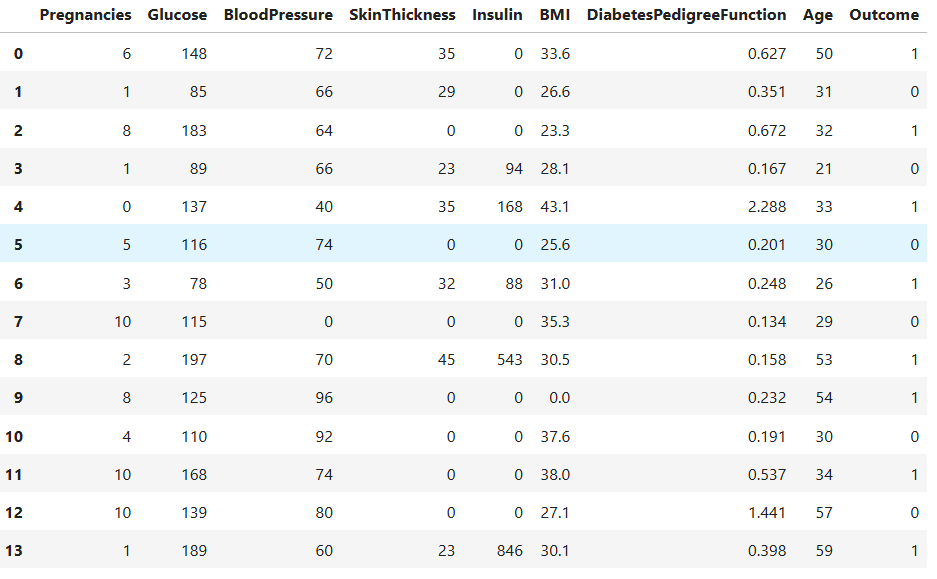
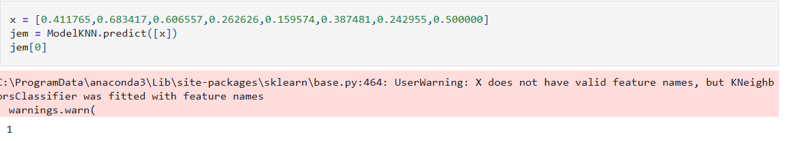

# Knn-based-diabet-prediction
KNN (k-nearest neighbors ) Basic Diabet Prediction
# Diabetes Prediction Using K-Nearest Neighbors (KNN)

This project uses the **K-Nearest Neighbors (KNN)** algorithm to predict the risk of diabetes based on patient medical data.

## About KNN

KNN is a **supervised machine learning** algorithm used for both classification and regression tasks.  
Its basic principle is:

1. For a new data point, find the **K nearest neighbors** in the dataset.  
2. In classification tasks, assign the **majority class** of these neighbors as the class of the new point.  
3. Distance is usually calculated using **Euclidean distance**.

**Advantages:**
- Simple and easy to understand
- Only requires choosing the number K
- Works well with moderate-sized datasets

**Disadvantages:**
- Can be slow with very large datasets
- Sensitive to feature scaling
- Sensitive to noisy data

## Diabetes Prediction

The KNN algorithm predicts diabetes risk by analyzing patient medical features such as **glucose level, body mass index (BMI), age, and blood pressure**.  
When a new patient’s data is provided, the algorithm finds the **K most similar patients** in the dataset and classifies the new patient’s diabetes status based on the **majority class** among these neighbors.  

This method provides a simple yet effective preliminary diagnostic tool, especially for **small to medium-sized health datasets**.

## Dataset

The project uses the [Pima Indians Diabetes Dataset](https://www.kaggle.com/uciml/pima-indians-diabetes-database) as an example dataset.
## How to use 
Input Data X Variable

